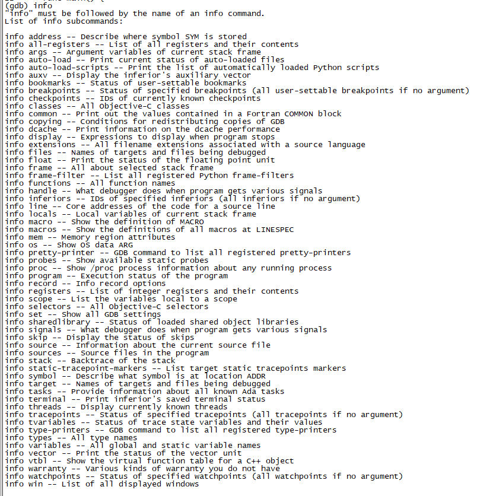

# GDB调试的基本使用

1. 运行程序: gdb xxx

2. 断点:

   1. 文件行: b main.go:4     ===>fileName:line
   2. 方法: b main.add ===>package.methodName

3. 下一行: next     ===>快捷键 :n

4. 进入方法: step  ===>快捷键: s

5. 汇编: layout asm    上翻下翻: pageUp pageDown

6. 显示多行源码: list     ===>快捷键:l

7. 开始运行程序: run ===>快捷键:r

8. 装入要调试的程序: file===>filexxx

9. 打印变量的值:print ===>快捷键:p

10. 运行程序直到下一个断点: continue ===>快捷键:c

11. 跟踪某个变量: display ===>快捷键:disp

12. 描述程序的状态: info

    

13. 终止正在调试的程序: kill ===>快捷键:k

14. 监视变量值的变化: watch  ===>watch $变量

15. 查看函数调用堆栈信息: backtrace ===>快捷键: bt

16. 查看栈帧: frame ===>快捷键f

17. 退出: quit ===>快捷键: q

18. 查看汇编指令：disass main.f

19. 汇编进行调试：layout asm/regs    ni(下一行)/si（下一行，遇到方法跳进去）

20. 查询变量：x/2x $sp等等
